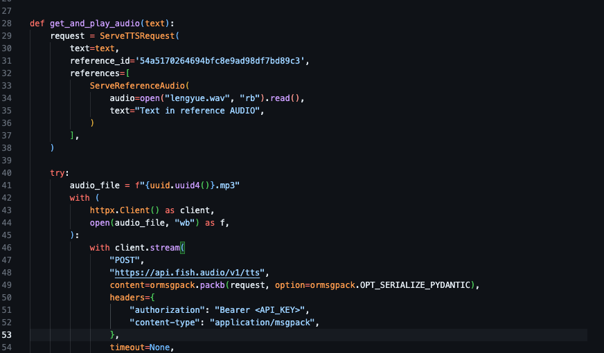

## Automated video play script

Enter your fish auto api into the script, then you can use that model to create a continue audio stream. Kind like streaming.
API position  
Get you API from here: https://fish.audio/go-api/
Just run the audio.py to start your AI talking, default video model is Dingzhen, if you want you can replace any model you want by change the reference ID.

## replace your api here:

